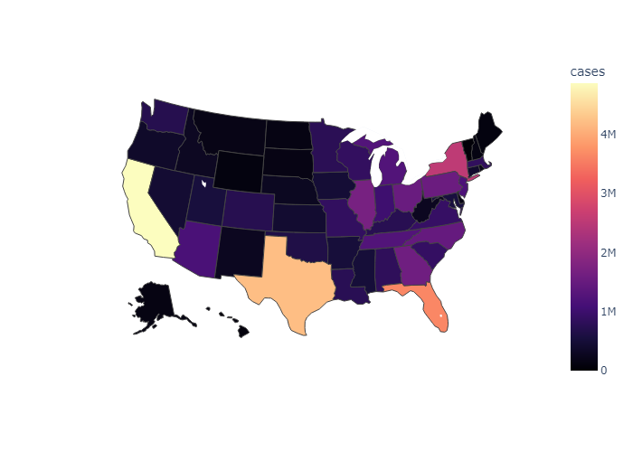
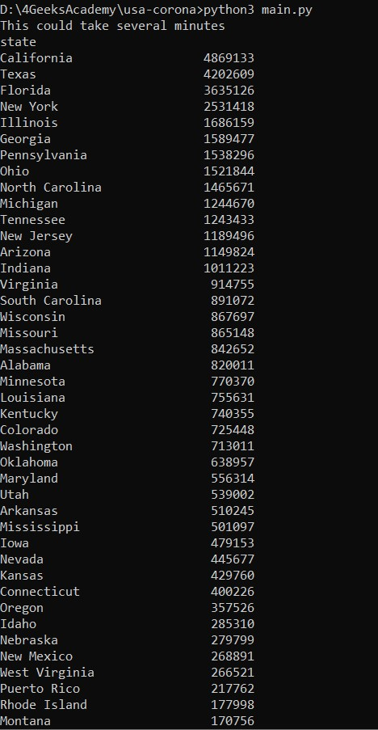
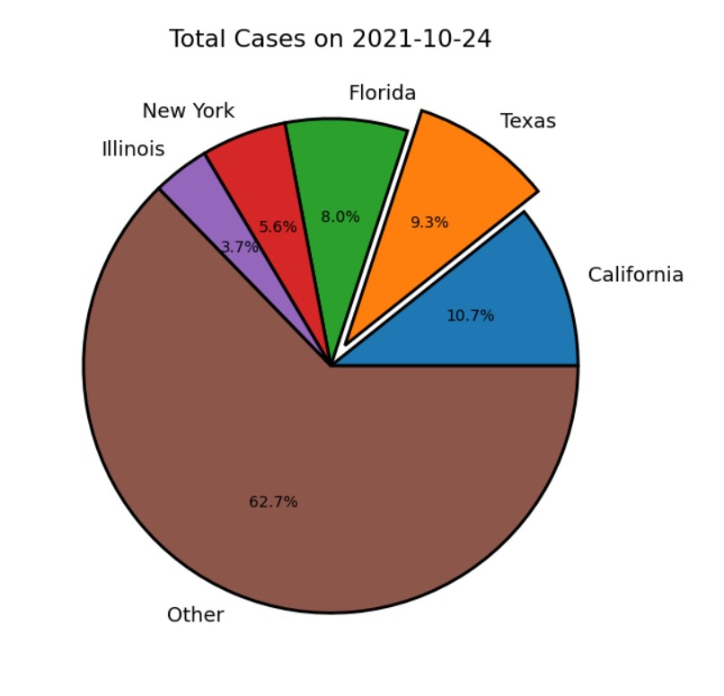

<!-- Sección portada del repositorio -->
<a href="#">
    
</a>

Está hecho pensando en usuarios de nivel básico.

Descargar los archivos en una misma carpeta.

## Qué se necesita si soy usuario de Windows 10?

Se necesita tener instalado Python 3.9 (preferiblemente), el cual puede descargarse desde la tienda oficial de Microsoft de forma gratuita.

- [Python 3.9](https://www.microsoft.com/store/productId/9P7QFQMJRFP7)

También es necesario instalar algunas dependencias de Python la primera vez para el correcto funcionamiento del script, para esto tan sólo se debe dar doble click al archivo: `instalar dependencias.bat`. Si por el contrario, se desean instalar las dependencias de Python de forma manual, es necesario ejecutar las siguientes líneas de código en el prompt (parece repetir, pero es una forma de evitar errores si hay más de una versión de python en el pc, o más de un usuario incluso en windows):

```sh
pip3 install pandas
python3 -m pip install --upgrade pip
pip3 install matplotlib
pip3 install plotly_express==0.4.0
python -m pip install --upgrade pip
python3 -m pip install matplotlib --user
python3 -m pip install plotly_express==0.4.0
pip install -U kaleido
```

## Cómo ejecuto el script de Python?
 
Para ejecutar el script, basta con darle doble click al archivo: `Run main.bat`. Aunque si se desea ejecutar el script manualmente, hay que abrir el prompt de Windows, navegar hasta la dirección en que están contenidos los archivos, y ejecutar:

```sh
python3 main.py
```

## Explicación 
Este es un script que obtiene la data sobre casos de SARS-CoV-2 en los Estados Unidos, organiza la totalidad de casos hasta la fecha, y los coloca en un mapa con rango de colores.

<a href="#">
    
    
</a>

URL data = https://raw.githubusercontent.com/nytimes/covid-19-data/master/us-counties.csv
